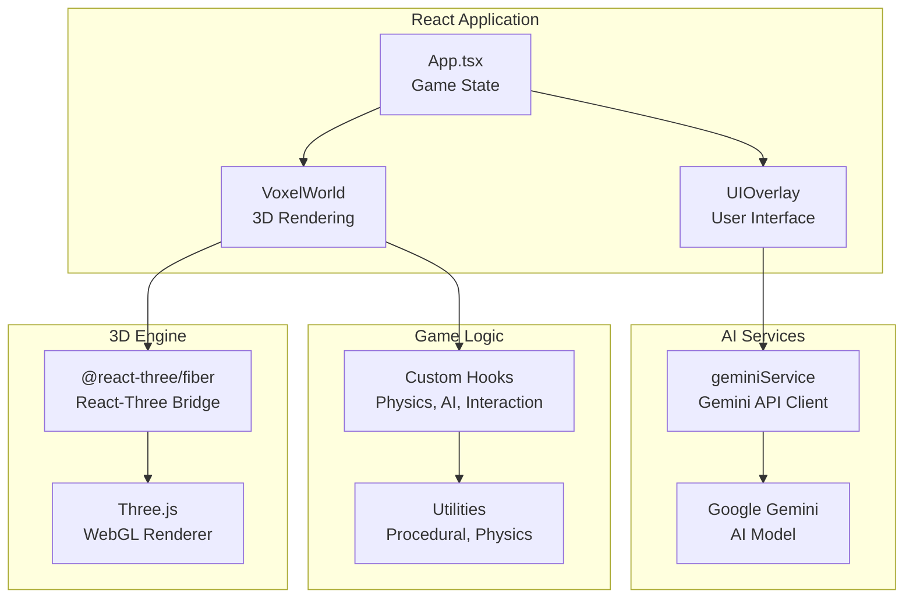
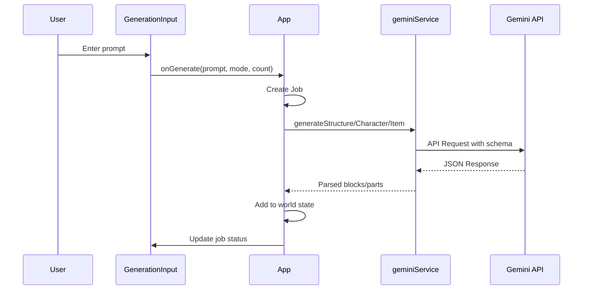
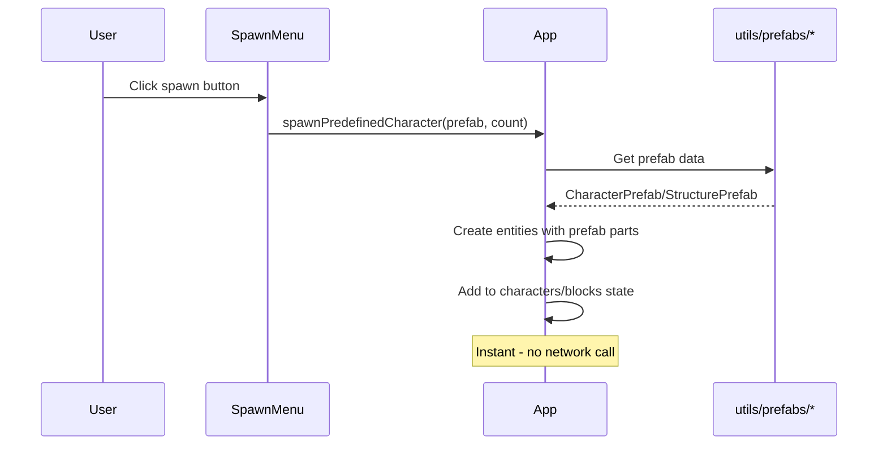
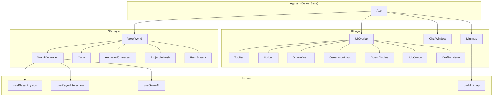
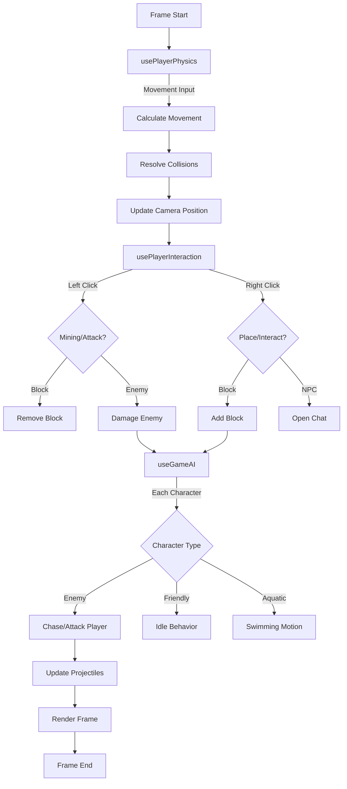
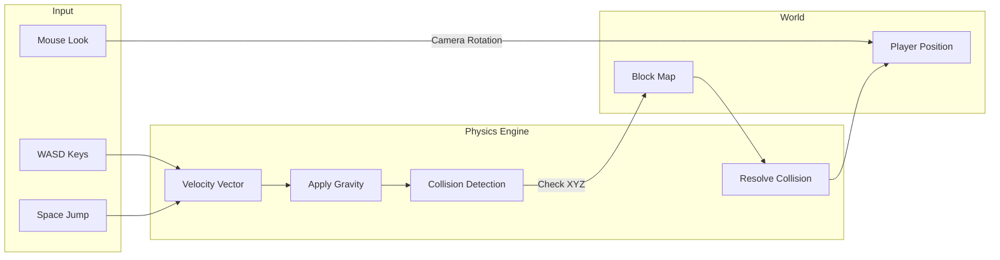

# Architecture

This document provides a technical overview of Adventure Craft's architecture and project structure.

## Project Structure

```
adventure-craft/
├── App.tsx                 # Main application component & game state
├── index.tsx               # Application entry point
├── index.html              # HTML template
├── types.ts                # TypeScript type definitions
├── server.js               # Production HTTP server
├── vite.config.ts          # Vite build configuration
├── package.json            # Dependencies and scripts
│
├── components/             # React components
│   ├── VoxelWorld.tsx      # Main 3D canvas & world renderer
│   ├── AnimatedCharacter.tsx  # Character rendering with animations
│   ├── Cube.tsx            # Single voxel block component
│   ├── Minimap.tsx         # In-game minimap component
│   ├── ProjectileMesh.tsx  # Projectile renderer
│   ├── StartScreen.tsx     # Game start screen
│   ├── UIOverlay.tsx       # Main UI overlay container
│   ├── WorldController.tsx # Player camera & world updates
│   ├── environment/        # Environmental effects
│   │   └── RainSystem.tsx  # Rain particle system
│   └── ui/                 # UI components
│       ├── ChatWindow.tsx  # NPC dialogue interface
│       ├── CraftingMenu.tsx # Crafting interface
│       ├── GenerationInput.tsx # AI prompt input
│       ├── Hotbar.tsx      # Inventory hotbar
│       ├── JobQueue.tsx    # Generation job status
│       ├── QuestDisplay.tsx # Quest tracker
│       ├── SpawnMenu.tsx   # Quick spawn buttons (prefab-based)
│       └── TopBar.tsx      # Status bars & actions
│
├── hooks/                  # Custom React hooks
│   ├── useGameAI.ts        # AI character behavior loop
│   ├── useMinimap.ts       # Minimap rendering logic
│   ├── usePlayerInteraction.ts # Mining, placing, combat
│   ├── usePlayerPhysics.ts # Movement & collision
│   └── useRainAudio.ts     # Rain sound effects
│
├── services/               # External services
│   └── geminiService.ts    # Google Gemini AI integration
│
├── utils/                  # Utility functions
│   ├── physics.ts          # Collision detection & raycasting
│   ├── procedural.ts       # Terrain generation
│   ├── textures.ts         # Block texture data
│   ├── ai/                 # AI behavior modules
│   │   ├── enemyBehavior.ts    # Enemy chase/attack logic
│   │   ├── friendlyBehavior.ts # NPC idle behavior
│   │   └── aquaticBehavior.ts  # Fish swimming behavior
│   └── prefabs/            # Predefined spawn templates
│       ├── characters.ts   # Animal, enemy, NPC prefabs
│       └── structures.ts   # Building, tree, fountain prefabs
│
├── src/                    # Source assets
│   └── index.css           # Global styles & Tailwind
│
└── dist/                   # Production build output
```

## Core Architecture



## Data Flow

### Game State (App.tsx)

The main `App.tsx` component manages all game state:

```typescript
// Core World State
blocks: Block[]              // All voxel blocks in the world
characters: Character[]      // NPCs and creatures
projectiles: Projectile[]    // Active projectiles
spawnMarkers: SpawnMarker[]  // Recent spawn locations

// Player State
playerHp: number             // Health points (0-100)
playerHunger: number         // Hunger (0-100)
inventory: InventoryItem[]   // Player inventory
activeSlot: number           // Selected hotbar slot

// World State
isDay: boolean               // Day/night cycle
isRaining: boolean           // Weather
viewMode: 'FP' | 'OVERHEAD'  // Camera perspective
expansionLevel: number       // World size tier

// Quest State
currentQuest: Quest | null   // Active quest
chatHistory: Record<string, ChatMessage[]>  // NPC dialogue
```

### Rendering Pipeline

1. **VoxelWorld** renders the 3D scene using `@react-three/fiber`
2. **WorldController** handles camera and player updates each frame
3. **useGameAI** updates character positions and behaviors
4. **usePlayerPhysics** handles movement and collisions
5. **usePlayerInteraction** handles mining, placing, and combat

### AI Generation Flow



### Predefined Spawn Flow (No API)

Quick spawn buttons use predefined prefabs for instant spawning without API calls:



---

## Component Hierarchy



---

## Game Loop



---

## Physics System



## Key Components

### VoxelWorld

The main 3D scene container using `@react-three/fiber`:

- Renders all blocks, characters, and projectiles
- Manages lighting and sky based on day/night
- Handles camera controls (PointerLock for FP, Orbit for overhead)
- Contains the `WorldController` for game logic

### WorldController

Invisible component that runs every frame:

- Updates player position via `usePlayerPhysics`
- Handles input via `usePlayerInteraction`
- Updates AI characters via `useGameAI`
- Syncs camera with player position

### geminiService

Interfaces with Google Gemini AI:

- `generateStructure(prompt)` — Creates voxel structures
- `generateCharacter(prompt)` — Creates animated creatures
- `generateItem(prompt)` — Creates inventory items
- `generateDialogue(npcName, message, history)` — NPC chat

## Type System

### Block

```typescript
interface Block {
  id: string;
  x: number;
  y: number;
  z: number;
  color: string;
  type?: string; // 'wood', 'stone', 'water', etc.
}
```

### Character

```typescript
interface Character {
  id: string;
  name: string;
  position: [number, number, number];
  rotation: number;
  parts: CharacterPart[]; // Head, body, arms, legs
  hp: number;
  maxHp: number;
  isEnemy: boolean;
  isFriendly?: boolean;
  isGiant?: boolean;
  isAquatic?: boolean;
}
```

### Quest

```typescript
interface Quest {
  id: string;
  title: string;
  requirements: Record<string, number>; // e.g. { 'wood': 10 }
  progress: Record<string, number>;
  completed: boolean;
}
```

## Build Configuration

### Vite Config Highlights

- **React Plugin** — JSX/TSX transformation
- **Tailwind CSS v4** — Utility-first CSS
- **Environment Variables** — API key injection via `define`
- **Code Splitting** — Vendor chunk for Three.js dependencies
- **Path Aliases** — `@/` maps to project root

### Production Server

The `server.js` file is a simple Node.js HTTP server that:

- Serves static files from `dist/`
- Handles SPA routing (fallback to `index.html`)
- Prevents directory traversal attacks
- Runs on Cloud Run with `PORT` environment variable
